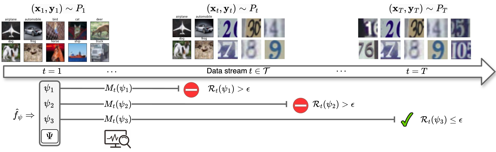

## Overview

This is the public code repository for our work
[On Continuous Monitoring of Risk Violations under Unknown Shift](https://proceedings.mlr.press/v286/timans25a.html) presented as a conference paper at the [41st Conference on Uncertainty in Artificial Intelligence (UAI)](https://www.auai.org/uai2025/).

<p align="center">
  
</p>

#### Abstract :memo:
---

Machine learning systems deployed in the real world must operate under dynamic and often unpredictable distribution shifts. This challenges the validity of statistical safety assurances on the system's risk established beforehand. Common risk control frameworks rely on fixed assumptions and lack mechanisms to continuously monitor deployment reliability. In this work, we propose a general framework for the real-time monitoring of risk violations in evolving data streams. Leveraging the `testing by betting' paradigm, we propose a sequential hypothesis testing procedure to detect violations of bounded risks associated with the model's decision-making mechanism, while ensuring control on the false alarm rate. Our method operates under minimal assumptions on the nature of encountered shifts, rendering it broadly applicable. We illustrate the effectiveness of our approach by monitoring risks in outlier detection and set prediction under a variety of shifts.

---

#### Citation
If you find this repository useful, please consider citing our work:

```
@inproceedings{timans2025riskmonitor,
    title = {On Continuous Monitoring of Risk Violations under Unknown Shift}, 
    author = {Alexander Timans and Rajeev Verma and Eric Nalisnick and Christian Naesseth},
    booktitle = {Proceedings of the 41st Conference on Uncertainty in Artificial Intelligence},
    year = {2025}
}
```

#### Acknowledgements
The [Robert Bosch GmbH](https://www.bosch.com) is acknowledged for financial support.

## Repo structure
The folder structure of the repo is quite self-explanatory, but below are some comments on each folder or file on the main repository level. The most important folder is ```exp```.

```
risk-monitor/
├── Wild_Time: A local copy of the Wild-Time repository with no custom changes (see below)
├── config: YAML files with config params per experiment. A description of the config file setup is given in the base config file cfg_exp.py. Note that this includes important path settings that typically hold across experiments, such as output, model, and data roots.
├── data: Empty for the most part. All datasets should be downloaded and stored here (see below). Only contains the augmented Naval propulsion dataset used in our experiment (uci-cbm/data_aug.csv).
├── exp: Contains each experiment's stand-alone main script and its associated file with risk monitors (or trackers). 
├── models: Actual model files should be downloaded and stored under /checkpoints (see below). resnet.py is a copy for the ResNet architecture taken from a public repo.
├── plots: Plotting utilities and the notebook plots.ipynb to reproduce final plots contained in the paper.
├── util: Read/write and other generic utilities.
├── commands.py: Script to create a file with python run commands to start a suite of experiments.
├── erc.yaml: A minimal environment file that contains all (most?) important packages to run the repo.
└── run.sh: A simple shell script that executes the run commands generated by commands.py in series, and logs errors.
```

To run the code, guidelines are provided below.

## Preparing the local setup
1. Clone repo, e.g. using git
```
git clone https://github.com/alextimans/risk-monitor
```
- Make sure to be in the parent directory of ```risk-monitor``` as working directory. Let's call it ```run-code```, so set working directory to ```run-code```. This directory is also the one from which to launch code runs, which is why the provided sample runs below follow the scheme ```python risk-monitor/script.py -args```.
- The internal name for the ```risk-monitor``` folder used by us was ```erc```, thus please replace any mention of ```erc``` with ```risk-monitor``` when path errors are thrown.

2. Set-up python env (e.g. with conda package manager)
```
conda env create -f risk-monitor/erc.yaml
conda activate conf1m
```
- Make sure that the PYTHONPATH environment variable also points to the ```risk-monitor``` repo to detect all python modules.
- Code is written to also be compatible with ```cuda``` and GPU support.

## Get and prepare models and data

1. Outlier Detection on CIFAR-10 and SVHN (S6.1)

- Model: We obtain a pretrained ResNet model from [PyTorch_CIFAR10](https://github.com/huyvnphan/PyTorch_CIFAR10). The repo can be cloned locally and its instructions followed. Alternatively only the model ```.pt``` file can be downloaded, and the necessary architecture file ```resnet.py``` is copied in ```models```.
- Data: CIFAR and SVHN are directly obtained from ```torchvision.datasets```, see ```exp/exp_ood.py```.

2. Set Prediction on FMoW (S6.2)

- Model: We follow the instructions of the [Wild-Time](https://github.com/huaxiuyao/Wild-Time) repository, which can be installed conveniently with ```pip install wildtime``` and contains necessary architecture and dataset files. A local clone is provided in this repository for good measure. Following the repository instructions, actual model files can be downloaded from their Google Drive; we only employ the models labelled ```fmow_ERM-*``` (FMoW for the dataset, ERM for empirical risk minimization). 
- Data: Running ```exp/exp_cp.py``` will call the FMoW data class inside ```wildtime```, which in turn loads the actual FMoW dataset internally when it is not found in the data root. This might take a while the first time it is invoked. ```exp/exp_cp.py``` automatically takes care of additional mappings between our experiment configs and data and model configs internal to ```wildtime```.

3. Set Prediction on Naval Propulsion (S6.2)

- Model: We employ a basic Random Forest Regressor using ```scikit-learn```. The model is called and fitted on the data the first time ```get_pred``` is invoked to compute predictions (see also below). 
- Data: We download the data from its [UCI Repository](https://archive.ics.uci.edu/dataset/316/condition+based+maintenance+of+naval+propulsion+plants) and manually place it inside ```uci-cbm```. Since our paper experiment augments the initial state with jittering, we explicitly provide the augmented data under ```uci-cbm/data_aug.csv``` as well. Thus in principle, no extra data download is required to reproduce the paper experiment. 

4. Double-check for correctness

- Data: Keep the data in their original folder structures except for ```uci-cbm```. You should now have a data folder accessible from the working directory, e.g., ```run-code/risk-monitor/data/...``` directly, or ```run-code/data/...``` and access from within ```risk-monitor``` with a symbolic link. Its structure should look something like

```
data
└── fmow_v1.1
    └── country_code_mapping.csv
    └── rgb_metadata.csv
    └── images
        └── rgb_img_xxx.png
        └── ...
└── uci-cbm
    └── data_aug.csv
    └── (optional) data.txt
    └── (optional) Features.txt
└── (optional) cifar or svhn data, or internally via torchvision.datasets
```

- Model: Place all model files in a folder accessible by the working directory, again something like ```run-code/risk-monitor/checkpoints``` or ```run-code/checkpoints``` and access from within ```risk-monitor``` with a symbolic link. Its structure should look something like

```
models
└── resnet.py
└── checkpoints
    └── resnet18.pt
    └── resnet34.pt
    └── resnet50.pt
    └── fmow_ERM-train_update_iter=3000-lr=0.0001-mini_batch_size=64-seed=1-offline_time=13
```

## Running the code

- Each experiment's configuration is contained in a separate config file, e.g. ```config/exp_ood/cfg_step.yaml``` for the outlier detection experiment with step-wise shift. Possible keys (with their defaults) are detailed in ```config/cfg_exp.py```, and subsequently overriden in the experiment-specific file where appropriate or necessary. A final run-specific override can be done via CLI arguments. Thus the chain of commands runs like ```cfg_exp.py -> cfg_step.yaml -> CLI args in cfg_ood.py```, ultimately determining the experiment's configurations.
- The config files include path directory names, which will most likely initially throw errors due to non-matching paths. Modify/remove as necessary to obtain the correct directory pointers (see again ```config/cfg_exp.py``` for the total suite of possible keys).
- To check the main script CLI arguments that can be given and their default values and short explanations, check within the experiment of interest, e.g.
```
python risk-monitor/exp/exp_ood.py -h
```
- The full suite of experiment runs to recreate all results is given in ```commands.txt```, and can be customized using ```commands.py``` to generate new run files. It can also serve as inspiration how a single run command might look like, e.g. for the outlier detection experiment with step-wise shift this might look like
```
python risk-monitor/exp/exp_ood.py --cfg_file=cfg_step --cfg_dir=risk-monitor/config/exp_ood --exp_suffix=_TESTING --get_pred --save_file --batch_ts=1 --tracker_window 0 0 0 --stop_counter 5 25 0 --device=cuda
```
- To explicitly run the full suite of experiments (read and run all combos in ```commands.txt```) for reproduction, run
```
sh risk-monitor/run.sh
```
- Note that the first time any experiment is run, you'll need to set the flag as ```--get_pred``` (i.e. True) in order to internally call ```def get_pred(...)``` to load the model and data and perform the necessary prediction computes on the full dataset. These predictions and other necessary data (e.g. confidences, labels) are then stored in the root of the experiment output folder (key ```LOAD_DIR```). For any subsequent deployment scenarios (different monitoring settings, trial repetitions) these files can then simply be loaded and used to simulate online deployment stream settings by setting the flag to ```--no-get_pred```. This substantially expedites experiments since we don’t require active model loading and calling during deployment by amortizing the cost beforehand. Of course, loading and re-computing predictions at every new run is also compatible.
- An executable run will create an associated output folder which logs all the results, and which is located in the output directory specified in the config file. The folder will contain a subfolder ```plots``` with some auto-generated diagnostics figures, a ```log.txt``` file, and if ```--save_file``` is set (i.e. True), individual ```.pt``` files storing the experimental results individually for risk monitor (or tracker). For a generic run this might then include
    - ```point_risk.pt```: The true unobservable population risk
    - ```running_risk.pt```: The running risk baseline
    - ```eprocess.pt```: The e-process $M_t(\psi)$ from the paper
    - ```naive_eprocess.pt```: The e-process $M^{SUM}_t(\psi)$ from the paper
    - ```pmeb_eprocess.pt```: The e-process $M^{EB}_t(\psi)$ from the paper
- Each ```.pt``` results file in turn contains a dictionary storing relevant results information, and includes the keys ```dict_keys(['risk', 'stop_time', 'psi_cs', 'psi_cs_size', 'psi_select', 'false_alarms', 'detection_delay'])```.
- To generate the explicit paper figures that can be saved to file, see the interactive ```plots/plots.ipynb``` notebook.

#### Still open questions?

If there are any problems you encounter which have not been addressed, please feel free to create an issue or reach out! 
